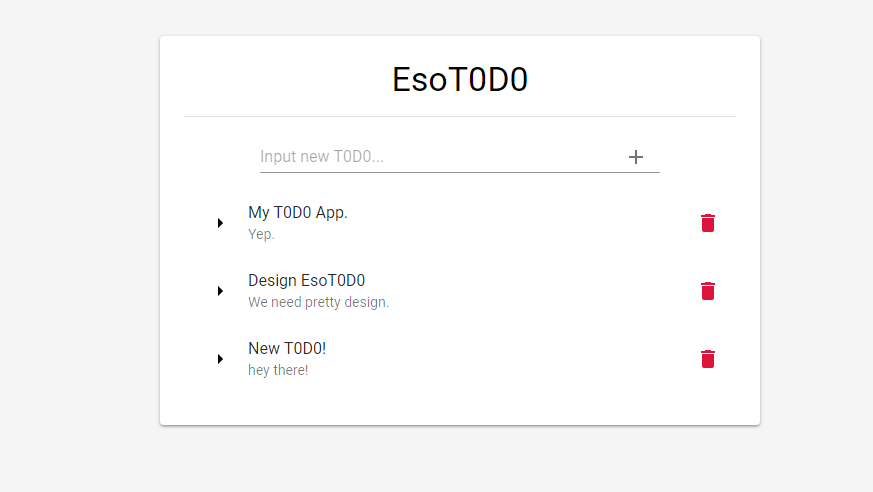
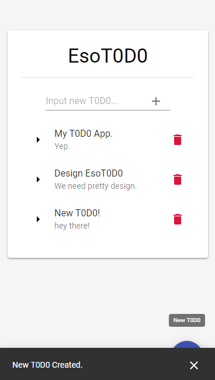

# EsoT0D0

Esot3riA's T0D0 Web Application based on MERN(MongoDB-Express-React-NodeJS) Stack.

----------------
### Requirements

* Yarn
* MongoDB
* Node.js
* Express
* React

----------------
### Usage

1. Start DB.
```
service mongodb start
```
2. Install Dependencies and Start EsoT0D0 Restful API Server.
```
cd EsoT0D0
yarn install
yarn start &
```
3. Install Dependencies and Start EsoT0D0 Client.
```
cd ../Esot0D0
yarn install
yarn start
```
4. Connect https://esot3ria.run.goorm.io
5. That's it!

----------------
### Screenshots




